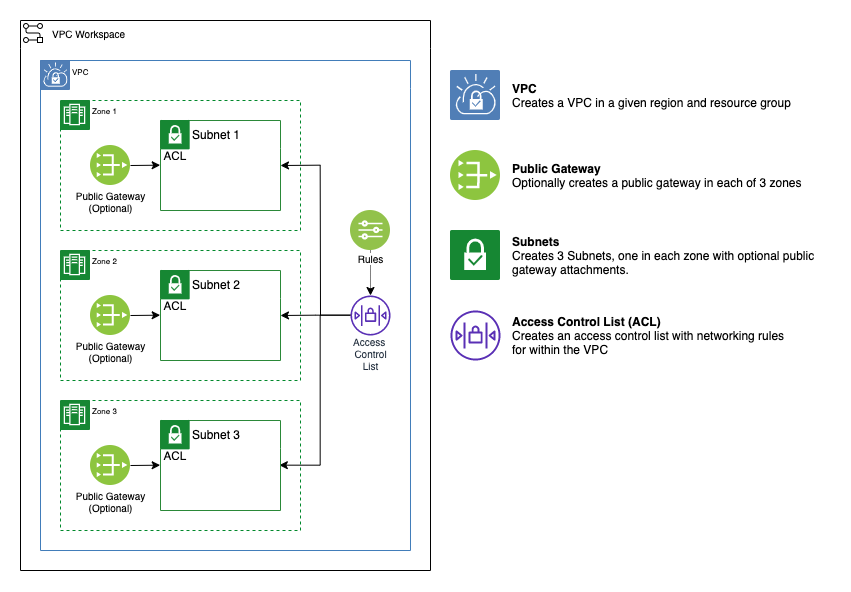

# VPC Workspace

This module creates a multizone VPC in a single region with a single subnet in each zone. It will create an example ACL and can optionally create public gateways for each zone. 

Currently IBM Schematics only supports terraform version 0.11, but modules are included for 0.12.0.



### Table of Contents

1. [VPC](##VPC)
2. [Subnets](##Subnets)
3. [Public Gateway](##public%20gateway)
4. [Access Control List (ACL)](##Access%20Control%20List)
5. [Module Variables](##module%20variables)
6. [Outputs](##Outputs)
7. [As a Module in a Larger Architecture](##As-a-Module-in-a-Larger-Architecture)

------

## VPC

This module creates a VPC in a single region inside a resource group.

Use IBM Cloud™ Virtual Private Cloud to create your own space in IBM Cloud™. A virtual private cloud (VPC) is a secure, isolated virtual network that combines the security of a private cloud with the availability and scalability of IBM's public cloud. <sup>[1](https://cloud.ibm.com/docs/vpc?topic=vpc-about-vpc)</sup>

#### VPC Specific Variables

- `classic_access` - Can be `true` or `false`. 
    - You can set up access from a VPC to your IBM Cloud classic infrastructure, including Direct Link connectivity. One VPC per region can communicate with classic resources.<sup>[2](https://cloud.ibm.com/docs/vpc?topic=vpc-about-vpc#about-classic-access)</sup>

#### More Info

- [Read more about VPC](https://cloud.ibm.com/docs/vpc?topic=vpc-about-vpc)
- [More about using the ibm_is_vpc terraform block in v0.12.0](https://ibm-cloud.github.io/tf-ibm-docs/v1.1.0/r/is_vpc.html)
- [More about using the ibm_is_vpc terraform block in v0.11.x](https://ibm-cloud.github.io/tf-ibm-docs/v0.23.0/r/is_vpc.html)

-------

## Subnets

This module creates 3 subnets, one in each of the geographic zones in the region where the VPC was created.

Each subnet consists of a specified IP address range (CIDR block). Subnets are bound to a single zone, and they cannot span multiple zones or regions. Subnets in the same VPC are connected to each other. <sup>[3](https://cloud.ibm.com/docs/vpc?topic=vpc-about-networking-for-vpc#subnets-in-the-vpc)</sup>

#### Subnet Specific Variables

- `cidr_blocks` - List of IP ranges
    - A list of **three** IP address ranges within the VPC where the subnet will be created.
    - Cannot be a [reserved IP address](https://cloud.ibm.com/docs/vpc?topic=vpc-about-networking-for-vpc#reserved-ip-addresses)

##### More Info

- [More about using the ibm_is_vpc_address_prefix terraform block in v0.12.0](https://ibm-cloud.github.io/tf-ibm-docs/v1.1.0/r/is_vpc_address_prefix.html)
- [More about using the ibm_is_vpc_address_prefix terraform block in v0.12.0](https://ibm-cloud.github.io/tf-ibm-docs/v1.1.0/r/is_vpc_address_prefix.html)
- [More about using the ibm_is_subnet terraform block in v0.11.x](https://ibm-cloud.github.io/tf-ibm-docs/v0.23.0/r/is_subnet.html)
- [More about using the ibm_is_subnet terraform block in v0.12.0](https://ibm-cloud.github.io/tf-ibm-docs/v1.1.0/r/is_subnet.html)  

-----

## Public Gateway

This module can optionally create public gateways attached to the subnets.

A Public Gateway enables a subnet and all its attached virtual server instances to connect to the internet. Subnets are private by default. After a subnet is attached to the public gateway, all instances in that subnet can connect to the internet. Although each zone has only one public gateway, the public gateway can be attached to multiple subnets.<sup>[4](https://cloud.ibm.com/docs/vpc?topic=vpc-about-networking-for-vpc#public-gateway-for-external-connectivity)</sup>

- [More about using the ibm_is_public_gateway terraform block in v0.12.0](https://ibm-cloud.github.io/tf-ibm-docs/v1.1.0/r/is_public_gateway.html)
- [More about using the ibm_is_public_gateway terraform block in v0.11.x](https://ibm-cloud.github.io/tf-ibm-docs/v0.23.0/r/is_public_gateway.html)

-----

## Access Control List

This module creates an ACL and attaches it to the subnets

You can use an access control list (ACL) to control all incoming and outgoing traffic in IBM Cloud™ Virtual Private Cloud. An ACL is a built-in, virtual firewall, similar to a security group. In contrast to security groups, ACL rules control traffic to and from the subnets, rather than to and from the instances.<sup>[5](https://cloud.ibm.com/docs/vpc?topic=vpc-using-acls)

### In Terraform 0.11.x

ACL Rules must be hard coded in the `network.tf` block.

### In Terraform 0.12.0

ACL rules can be added and update in an `acl_rules` variable block

#### More Info

- [More about ACLs](https://cloud.ibm.com/docs/vpc?topic=vpc-using-acls)
- [More about using the ibm_is_network_acl terraform block in v0.12.0](https://ibm-cloud.github.io/tf-ibm-docs/v1.1.0/r/is_network_acl.html)
- [More about using the ibm_is_network_acl terraform block in v0.11.x](https://ibm-cloud.github.io/tf-ibm-docs/v0.23.0/r/is_network_acl.html)

-----

## Module Variables

Default variables can be overwritten, any variables without a default must have a value entered in for the module to run.

Variable          | Type    | Description                                                               | Default
------------------|---------|---------------------------------------------------------------------------|--------
`ibmcloud_apikey` | String  | IBM Cloud IAM API Key                                                     | 
`ibm_region`      | String  | IBM Cloud region where all resources will be deployed                     | `us-south`
`resource_group`  | String  | Name of resource group to provision resources                             | `default`
`unique_id`       | String  | Prefix for all resources created in the module. Must begin with a letter. | 
`tags`            | List    | A list of tags for resources created                                      | `["multizone-vpc-module"]`
`classic_access`  | Boolean | VPC Classic Access                                                        | `false`
`cidr_blocks`     | List    | List of CIDR blocks for the subnets                                       | `["10.10.10.0/24", "10.10.11.0/24", "10.10.12.0/24"]`

-----

## Outputs

- `vpc_id`: ID of VPC created
- `subnet_ids`: List of subnets created by module
- `acl_id`: ID of ACL created

-----

## As a Module in a Larger Architecture

Use the [`./module`](.module) folder to include this in a larger architecture

Declaring this Module:

### Using Default Variables

```
data ibm_resource_group resource_group {
  name = "<your resource group name>"
}

module vpc {
    source = "./<path to your code>"
    ibm_region         = "<your value or reference>"
    resource_group_id  = "${data.ibm_resource_group.resource_group.id}"
    unique_id          = "<your value or reference>"
}
```

### Using Custom Variables

```
data ibm_resource_group resource_group {
  name = "<your resource group name>"
}

module vpc {
    source             = "./<path to your code>"
    ibm_region         = "<your value or reference>"
    resource_group_id  = "${data.ibm_resource_group.resource_group.id}"
    unique_id          = "<your value or reference>"
    tags               = "<your value or reference>"
    classic_access     = "<your value or reference>"
    cidr_blocks        = "<your value or reference>"
}

```